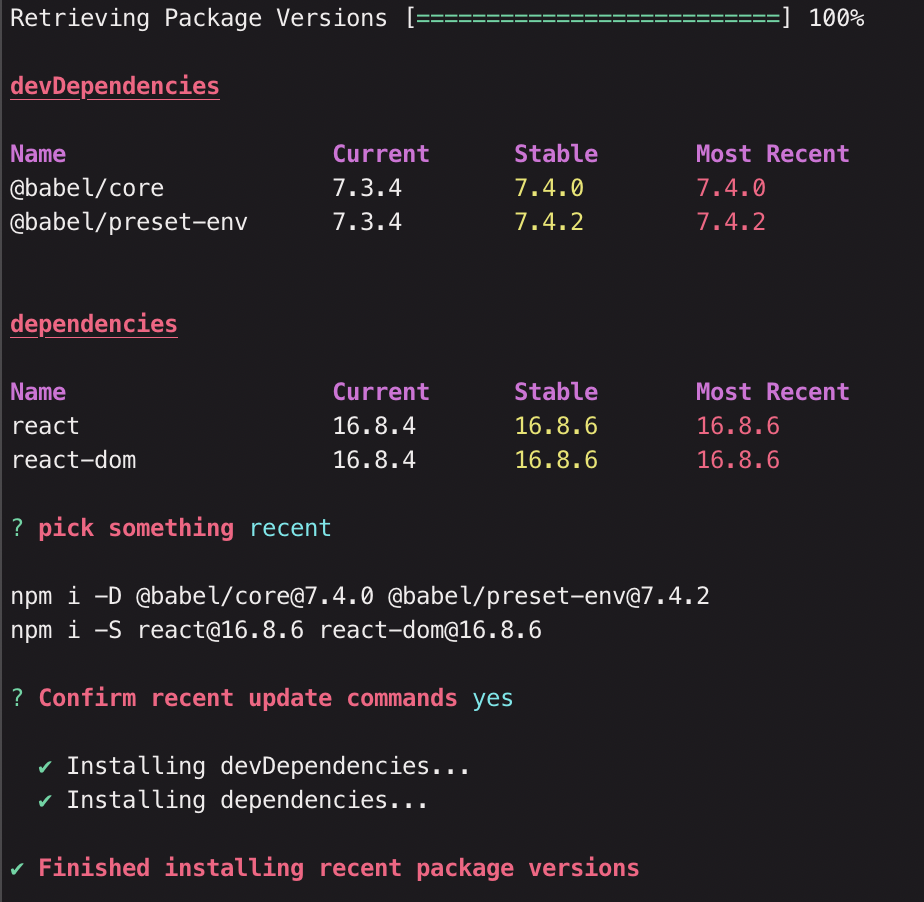

# @bopeng95/updater

`npm install -g @bopeng95/updater`

`upd <directory with package.json>`

`upd <directory with package.json> --all` to show all dependencies 

choose to have a stable or recent update for dependencies

